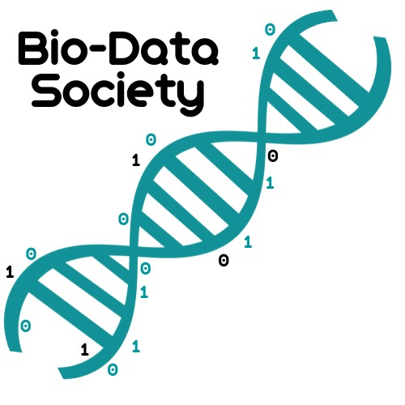

```print('Hello World!)```

We are society for those who want to learn more about where biology and programming intersect.

---
### Goals and Aims
Whilst we are still in the "setting up" period as well as being in the middle of the biggest pandemic in recent memory, we don't have any events booked or ready to go. But, what we have planned include:

- Team greets - many of the current members of the society are those on a flagship Bioinformatics Apprenticeship in 
association with institutes such as: The Sanger Institute, Illumina, Eagle Genomics, GSK and KyMab. 
To honor this we are planning to get a member of each team in to talk what, why and how they do their job.

- Talks - as well as the above talks and chats, we would also love to start getting speakers in to talk about various,
 university relevant subjects such as: genomics, data-base management, microbiology and any others that are suggested by our members.
 These talks are here to enhance what is taught during our time at university.

- Study help sessions - Everyone has their strengths and weaknesses whether they know it or not. 
These sessions will exist as a way to "Bring everyone up to speed", whether they are a programmer 
who wants to learn biology or vice versa.

- Program Jam (Gram-Jams?)- Programming is similar to learning a new language, and like learning a new language you need to
 exercise that skill regularly to keep it in shape. These Program Jams will involve an exercise that will be 
 voted on and can be worked in groups or solo (although we suggest groups as collaborative programming is a skill
  essential for professionals).

- Training materials - Be a small hub for training materials via our GitHub which will be completely open source.

---
### The Team - 2020
Being the first team of the BioData Society we are all keep to make a splash, 
so if you have any ideas or concerns you can contact us at: biodatasociety@outlook.com

- President: Damon-Lee Pointon


- Finance:          Cieran Lundy
- Finance Deputy:   David Munglah


- Administrator:    Saffron MacLeod-Burrows
- Admin Deputy:     Beth Sampher

---
### Event Calendar
Coming soon, the guy building this site has to figure out how to implement that.

---
### Contact us
You can contact us by visiting:

- [Facebook](https://www.facebook.com/groups/212560306589350/)
- [Twitter](https://twitter.com/aru_biodata)
- [ARU Society Page](https://www.angliastudent.com/socs/25414/)

Or simply emailing us at: biodatasociety@outlook.com
