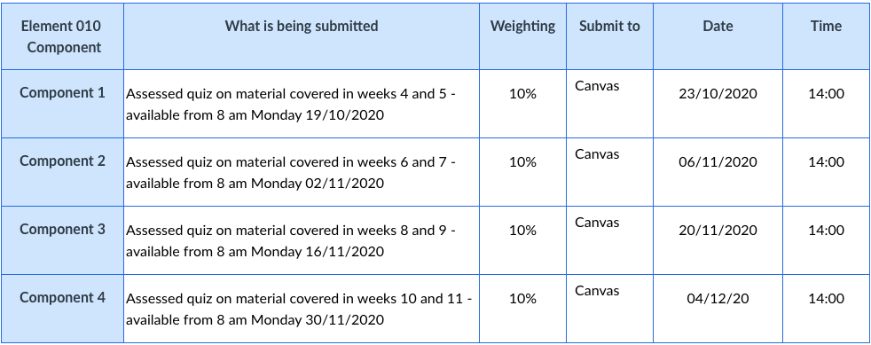
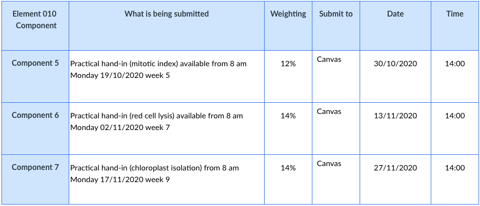
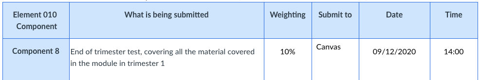
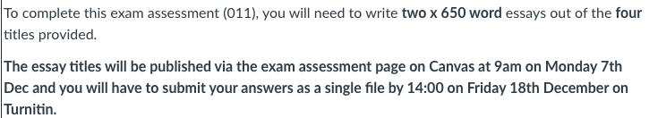
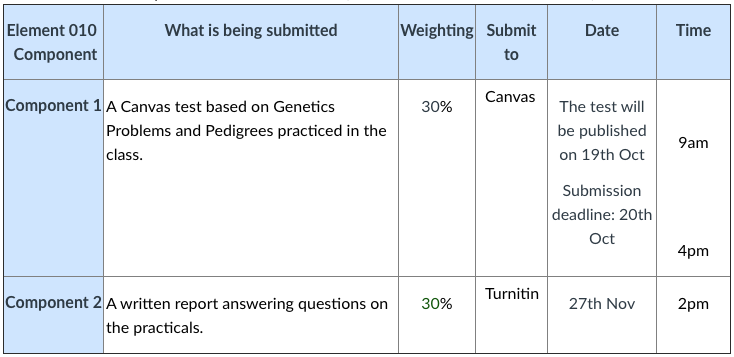

|  [Home](index.md)  |  [News](newsletters.md)  |  [Events](events.md)  |  [Finances](finances.md)  |  [Comments](comments.md)  |

# Welcome to the BioData Society's Trimester Newsletter/blog
The purpose of this is make sure everyone is on the same page when it comes to
 university and society events, for mentors to know what their apprentices are up to
 as well as a way to highlight anything that may be of benefit to the group such as
 educational tours to local and national scientific sites and off-site talks.

---

## Newsletter 2 - 13/10/2020
Once again thanks to everyone joining the society and apologies for not informing you about our next moves.
We are currently in talks with Sanger who would like to be our sponsors for events in the future (such as seminars)
which is fantastic seeing as they are world leaders in genomic research.

---

#### And now, the News...
Apart from the global pandemic that is still forcing us to all life as
hermits and in small social bubbles...

Many of us are working from our own space on out small bubbles with online
laboratories and online lectures as University relies heavily on
Microsoft Teams this year.

In this time please make sure you look after your mental health and try
something new and different every so often to keep that brain moving. 
I for instance just made a TwitterBot (Terry the TwitterBot) whose sole purpose is to annoy
people when i'm playing a game with that person, mostly because I need the advantage when playing PvP.

Hopefully we can see people once again some day and we can all hate each other for
the flood of "Haven't seen you since last year" jokes. Now back to university...

[University-wide Academic Calendar](https://web.anglia.ac.uk/anet/academic/public/calendar_20-21.pdf).
 
Because of COVID-19, the no detriment policy will continue to be in place.
This is calculated as the average of your modules in the same level
(e.g. Year 1 = Level 4, Year 2 = Level 5)
as long as you get a pass mark for the assessments (40%).

---

#### This Term
For the Bioinformaticians (To be shared with Line managers and Mentors).

---

#### 1 - Foundations of Cell Biology:

Foundations of Cell Biology is designed to provide an introduction to the cellular basis of life, focusing on their nature and
roles of different cell types, including animal, plant and microbial cells. The module provides students with a basic
understanding of biological organisation and biochemical processes at the cellular level. As such Foundations of Cell Biology
is a core module for students taking the Biomedical Science and Bioscience degree courses. The module introduces and
examines the different types of prokaryotic and eukaryotic cells, their identifying characteristics properties and key structural
differences. The role of viruses as cellular parasites is also considered. It also explores the basics of cell structure and
function, focusing on cell membranes and organelles, cellular energetics, the cell growth and division cycle, paying particular
attention to mitosis and meiosis. Understanding cell structure and function also requires a basic knowledge of the nature, roles
and chemical structures of key biomolecules, namely carbohydrates, lipids, nucleic acids and proteins. As well as providing
subject specific knowledge, relevant to biomedical sciences, this module helps develop a number of transferable skills
including practical (laboratory) techniques and skills relevant to employment including literacy and numerical skills. Standard
texts are available via the library and online companion website.

This has also included a variety of visualisation techniques such as Chromatography, Electronmicroscopy and X-ray Crystalography.

#### Goals include:
> Demonstrate a knowledge and understanding the structural differences
between viruses, prokaryotic cells and eukaryotic cells and the role of the
major eukaryotic cell organelles.
>
> Describe the nature and organisation and basic structure of the genetic
material in viruses, prokaryotic and eukaryotic cells and the activities
taking place during the cellular growth and division cycle.
>
> Describe the basic structure and functions of key macromolecules and the
ways in which cells obtain and utilise energy.
>
> Make simple biological calculations and perform some of the basic
laboratory techniques used in the handling, studying and identification of
different cell types and organelles and their functions.

#### Assessed by:
> Coursework is split into the following:
>
> In-class assessments - 30% weight
> 
>
> Practical report - 30% weight
> 
>
> In-class Test - 40% weight
> 
> 

#### Book list:
> Essentials include:
>
> Principles of Cell Biology - A standard book for understanding Cell Biology and can easily be replaced with:
> 
> Essential Cell Biology

> Recomended:
>
> Concepts of Genetics - Very handy book but there are some cases where terminology isn't what you're expecting.
>
> Practical skills in biomolecular sciences - Great for understanding the practical aspects of Biology and the methods which are best to use.

#### Recommended Time Allowance:

> 150 Hours for the Term
>
> 12.5 Hours per Week

#### Minimum Time Allowance:

> 34 Hours for the Term
>
> 2.8 Hours Per Week
>
> As we know however there is already more than
> 3 hours of preparation for the week as it is.
>
> This does not include time required for coursework.
---

#### 2 - Principles of Genetics

We live in the age of genetics and genomics, with breakthroughs in our understanding of genetic diseases and potential cures
regularly featured in the news. The pace of discovery in this field makes this an exciting time to be learning genetics. You will
gain knowledge and understanding of the fundamental principles of genetics and how we can answer questions such as: How
are genetic diseases inherited? How do scientists find out about complex diseases which are affected by both genes and
environmental factors? How can you find out how common a genetic disease is in a population?
You will discover how the study of genes offers a biologically-based explanation for morphological, physiological, and
behavioural traits of an organism. You will gain insights into how genetics provides a mechanism for the generation and
maintenance of variation; the raw material for evolution. We firstly consider the classical patterns of inheritance, building on
concepts you will have covered in level 4. You will develop an understanding of the relationship between genotype and
phenotype through an integration of concepts at the organismal, cellular and molecular levels. You will investigate gross
structural chromosome mutations and the phenotypic consequences of these mutation, and will learn how classical and
modern techniques are used for establishing the physical locations of genes. You will gain insights into gene function and the
genetic basis of many diseases, and go on to look at how traits may be determined by many genes and how genes interact
with environmental factors. You will learn to use mathematical methods to analyse genetic variation found in populations. You
will learn how gene expression is regulated in the development genetics, and look the genetics of cancer.
Modern tools of genetic research and analysis are incorporated throughout the module. Your understanding of genetic
processes will be developed through a variety of problems, case studies, simple breeding experiments and other practicals.
As well as gaining specific subject knowledge, this module helps you to develop a number of transferable skills including
practical laboratory techniques and skills relevant to general employment including data collection, handling and presentation
and report writing. You will have an opportunity to hear guest speakers talking about their careers in the field of genetics. The
content of the module is an essential part of your training towards a career in biomedical science.

#### Goals include:
> Structure and function of DNA, RNA and proteins with regard to structure and function of genes and principles of
inheritance
>
>> Mendelian genetics including single gene, multigene and extranuclear inheritance, epistasis and pleiotropy
>>
>>Human pedigrees
>>
>> Gene mapping
>
> Population genetics
>
> Quantitative genetics
>
> Principles of genomic, transcriptomic and proteomic methods used to study human chromosomes and DNA
>
> Developmental genetics
>
> Genetic disorders with biomedical significance
>
>> Chromosomal mutations
>>
>> Cancer genetics
>
> Demonstrate a detailed knowledge of the nature of genes and
chromosomes, the principles of inheritance, and the biological
consequences of mutations.
>
> Demonstrate knowledge and understanding of polygenic and multifactorial
traits within an individual, and genetic variation within populations, and how
this relates to biodiversity
>
> Demonstrate knowledge and understanding of the techniques used to map
genes to their chromosomal positions, and the role of genes in
development, normal function and disease
>
> Work collaboratively with others to carry out and collect data from genetic
experiments and then apply appropriate statistical tests in order to critically
analyse and interpret results

#### Assessed by:
> Coursework 60% 
>> Lab Report
>
> 
>
> In-class Test - 40% weight
>
> 

#### Book list:
> Concepts of Genetics - Very handy book but there are some cases where terminology isn't what you're expecting.
>> This book will come up multiple time so may be worth purchasing in the future.

#### Recommended Time Allowance:

> 150 Hours for the Term
>
> 12.5 Hours per Week

#### Minimum Time Allowance:

> 34 Hours for the Term
>
> 2.8 Hours Per Week
>
> As we know however there is already more than
> 3 hours of preparation for the week as it is.
>
> This does not include time required for coursework.
---

#### Previous and Future Letters

[Year-1-Tri-3](docs/old_news.md)

[Year-2-Tri-1](newsletters.md)

[Year-2-Tri-2](docs/ooothefuture.md)

[Year-2-Tri-3](docs/morefuture.md)

---

##### More Notes
Finally, Congrats to all students managing to get through another exam and good look starting the next module.

#### Thanks for reading